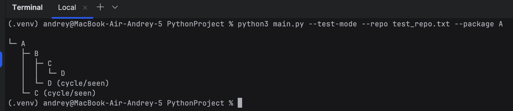
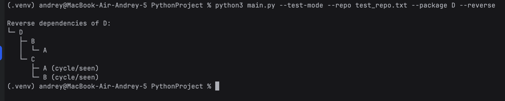

# Вариант №13 — Визуализация графа зависимостей

Инструмент для построения графов зависимостей пакетов. Реализованы все этапы задания.

## Этап 1
Минимальное CLI с параметрами: `--package`, `--repo`, `--test-mode`, `--filter`, `--output`, `--conf-dump`, `--reverse`.  
Выполнена валидация и обработка ошибок.

## Этап 2
Получение прямых зависимостей пакетов через API crates.io без использования готовых менеджеров.  
Определение последней версии и фильтрация optional/non-normal зависимостей.

## Этап 3
Построение полного графа (DFS), игнор по подстроке, обработка циклов.  
Поддержан тестовый режим (файл с узлами A, B, C...).  
Пример запуска:

```bash
python3 main.py --test-mode --repo test_repo.txt --package A
```


## Этап 4
Построение обратных зависимостей в тестовом режиме:
```bash
python3 main.py --test-mode --repo test_repo.txt --package D --reverse
```


## Этап 5

Визуализация графа: ASCII-дерево (по умолчанию) или формат Graphviz DOT.  
Готовые `.dot` можно конвертировать в PNG:

```bash
dot -Tpng serde.dot -o serde.png
```
### Использованные пакеты:
serde — библиотека сериализации

clap — парсер CLI-аргументов

reqwest — HTTP-клиент
